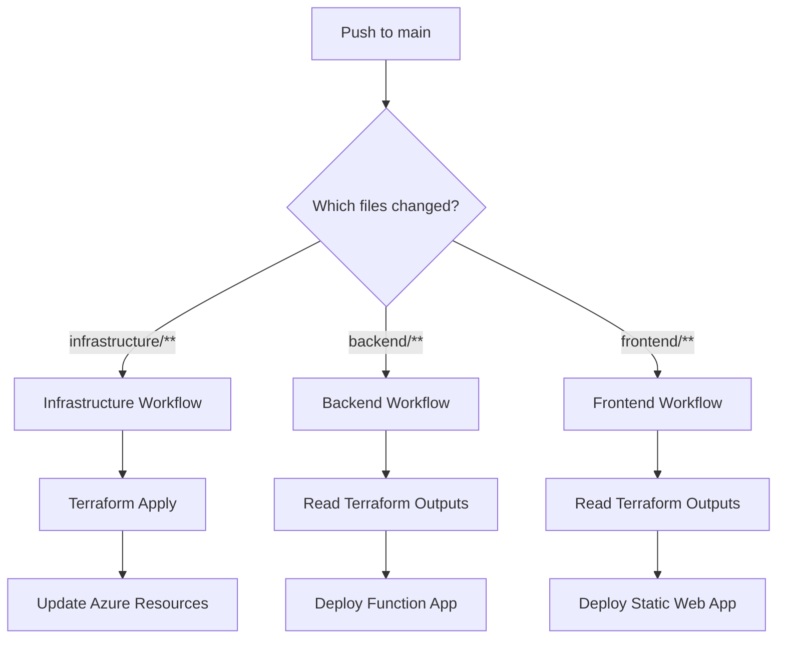

# GitHub Actions Workflow Reference

## Workflow Triggers

### Infrastructure Deployment

**File:** `.github/workflows/infrastructure-deploy.yml`

**Triggers on:**

- Push to `main` with changes in `infrastructure/**`
- Pull requests to `main` with changes in `infrastructure/**`
- Manual trigger via workflow_dispatch

**Actions:**

1. Terraform format check
2. Terraform init
3. Terraform validate
4. Terraform plan (PRs only - adds comment)
5. Terraform apply (main branch only)

**Duration:** ~8 minutes

---

### Backend Deployment

**File:** `.github/workflows/backend-deploy.yml`

**Triggers on:**

- Push to `main` with changes in `backend/**`
- Pull requests to `main` with changes in `backend/**`
- Manual trigger via workflow_dispatch

**Actions:**

1. Get Function App name from Terraform outputs
2. Install npm dependencies
3. Build TypeScript
4. Run tests
5. Deploy to Azure Functions
6. Verify health check

**Duration:** ~3 minutes

---

### Frontend Deployment

**File:** `.github/workflows/frontend-deploy.yml`

**Triggers on:**

- Push to `main` with changes in `frontend/**`
- Pull requests to `main` with changes in `frontend/**`
- Manual trigger via workflow_dispatch

**Actions:**

1. Get Static Web App details from Terraform
2. Install npm dependencies
3. Build React app with API URL
4. Deploy to Azure Static Web Apps
5. Verify deployment

**Duration:** ~2 minutes

---

## Workflow Dependencies



## Examples

### Scenario 1: Infrastructure Change

```bash
# Change Terraform files
vim infrastructure/variables.tf

# Commit and push
git add infrastructure/
git commit -m "Update region to northeurope"
git push origin main

# Result: Only infrastructure-deploy.yml runs
```

### Scenario 2: Backend API Update

```bash
# Change backend code
vim backend/src/functions/parseCV.ts

# Commit and push
git add backend/
git commit -m "Improve CV parsing logic"
git push origin main

# Result: Only backend-deploy.yml runs
```

### Scenario 3: Frontend UI Change

```bash
# Change React components
vim frontend/src/pages/HomePage.tsx

# Commit and push
git add frontend/
git commit -m "Update homepage styling"
git push origin main

# Result: Only frontend-deploy.yml runs
```

### Scenario 4: Multiple Changes

```bash
# Change both backend and frontend
vim backend/src/functions/matchJob.ts
vim frontend/src/pages/CVAnalysisPage.tsx

# Commit and push
git add backend/ frontend/
git commit -m "Add job matching feature"
git push origin main

# Result: Both backend-deploy.yml AND frontend-deploy.yml run in parallel
```

### Scenario 5: Full Deployment

```bash
# Change all three
vim infrastructure/main.tf
vim backend/src/config/index.ts
vim frontend/src/App.tsx

# Commit and push
git add -A
git commit -m "Major update across stack"
git push origin main

# Result: All three workflows run
# Order: infrastructure → backend & frontend (parallel)
```

## Pull Request Workflow

When creating a PR:

1. **Infrastructure changes** → Terraform plan shown in PR comments
2. **Backend changes** → Build and test, no deployment
3. **Frontend changes** → Build only, no deployment

When PR is merged to main:

- Deployments execute automatically

## Manual Deployment

To manually trigger any workflow:

1. Go to GitHub Actions tab
2. Select the workflow
3. Click "Run workflow"
4. Choose branch (usually `main`)
5. Click "Run workflow" button

## Required GitHub Secrets

All workflows require:

- `AZURE_CLIENT_ID` - Service Principal App ID
- `AZURE_TENANT_ID` - Azure AD Tenant ID
- `AZURE_SUBSCRIPTION_ID` - Azure Subscription ID

These enable OIDC authentication (no passwords stored).

## Monitoring Deployments

View real-time deployment status:

```
https://github.com/jonnychipz/JobFitAI/actions
```

Each workflow provides:

- Step-by-step execution logs
- Deployment summaries
- Azure Portal links
- Error details if failures occur

## Troubleshooting

### Workflow doesn't trigger

- Check file path patterns in workflow file
- Ensure changes are pushed to `main` branch
- Verify workflow file syntax (YAML)

### Terraform plan fails

- Check Azure credentials and permissions
- Verify Terraform syntax: `terraform validate`
- Review error in workflow logs

### Deployment fails

- Check Application Insights for errors
- Verify Azure resources exist
- Check GitHub secrets are configured
- Review workflow logs for specific errors

## Best Practices

1. **Test locally first**

   ```bash
   # Infrastructure
   cd infrastructure && terraform plan

   # Backend
   cd backend && npm run build && npm test

   # Frontend
   cd frontend && npm run build
   ```

2. **Use feature branches**

   ```bash
   git checkout -b feature/new-feature
   # Make changes
   git push origin feature/new-feature
   # Create PR → workflows validate
   # Merge PR → workflows deploy
   ```

3. **Review Terraform plans**

   - Always check plan output in PR comments
   - Understand what resources will change
   - Approve plans before merging

4. **Monitor deployments**

   - Watch GitHub Actions for errors
   - Check Azure Portal after deployment
   - Verify application functionality

5. **Rollback if needed**
   ```bash
   # Revert last commit
   git revert HEAD
   git push origin main
   # Workflows redeploy previous version
   ```
